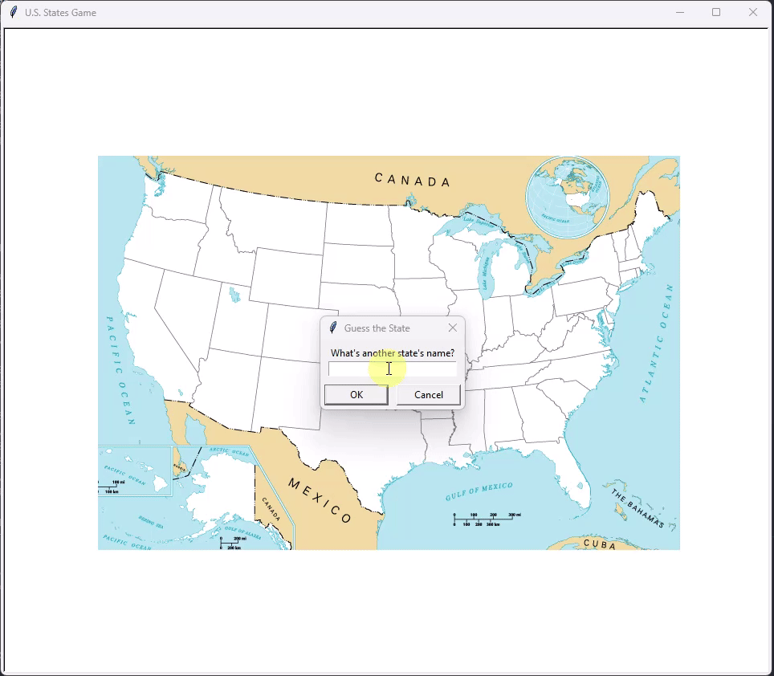

# Python US States Guessing Game
A simple US States Guessing Game using Python

## Introduction
The project is inspired by [Can you name the US states](https://www.sporcle.com/games/g/states).

The game is written in Python.
* The python script [main.py](./main.py) reads data from a list of [50 US states](./50_states.csv) using [Pandas](https://pandas.pydata.org/docs/index.html).
* It prompts user for guessing a name of state. If guessed correctly, the name of state will be written on a [US map](./blank_states_img.gif).

## How to run
The game requires Python 3 installed.

Clone the repo and launch the game using the following command:
```bash
python main.py
```

Then follow the game instruction to play.

## Demo


